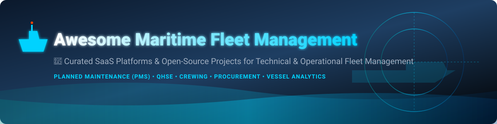

# Awesome Maritime Fleet Management 🚢 ⚓ 🌊

## 🌐 Top Maritime Fleet Management Ecosystem 🚢

**Curated List of Commercial SaaS Software & Open-Source GitHub Projects**  
*Focused on Ship & Fleet Management, Planned Maintenance Systems (PMS), Technical Operations, Maritime Compliance, Procurement Integration, Crewing & Shore–Ship Collaboration.*

> 📅 **Last updated: September 2026**

---

This repository tracks top-tier **SaaS / commercial software platforms** and **open-source projects** for **Maritime Fleet Management**. These software suites support technical, operational, and commercial management of vessels, ships, and maritime fleets—covering planned maintenance (PMS), spare-parts inventory, procurement, QHSE/safety compliance, crew management, vessel certificates, performance analytics, and environmental reporting (EU ETS / IMO DCS / CII).

---

## 📑 Table of Contents

- [📊 Sector Overview & Market Size](#-sector-overview--market-size)
- [🏢 Commercial SaaS / Hosted Platforms](#-commercial-saas--hosted-platforms)
- [💻 Open-Source GitHub Projects](#-open-source-github-projects)
- [🤝 How to Contribute](#-how-to-contribute)
- [💖 Support & Sponsorship](#-support--sponsorship)
- [⚠️ Disclaimer](#%EF%B8%8F-disclaimer)
- [📈 Star History](#-star-history)

---

## 📊 Sector Overview & Market Size 📈

> 💡 **Market Size & Structure**: The global **Maritime Fleet Management Software Market** is estimated at **~$1.8 Billion to $2.2 Billion USD** (2025/2026) and is projected to reach **~$3.5+ Billion USD by 2032** growing at a CAGR of 7.5%–9.0%.  
> 🧩 **Market Fragmentation**: The sector is **moderately fragmented**, dominated by established classification societies (e.g., DNV, ABS), maritime industrial technology conglomerates (e.g., Kongsberg, Alfa Laval), and specialized vertical ERP software groups (e.g., Volaris/SpecTec, DANAOS, MariApps). High regulatory requirements (ISM Code, SOLAS, MARPOL, EU ETS) create strong moats for certified commercial platforms.

---

## 🏢 Commercial SaaS / Hosted Platforms 💼

Commercial platforms dominate professional shipping, offering enterprise-grade planned maintenance systems (PMS), regulatory compliance suites, and ship-to-shore data synchronization.

| SaaS Platform / Suite 🚢 | Enterprise / Parent Company 🏢 | Estimated Size / Revenue / Valuation 💰 | Pricing (Starting Tier) 🏷️ | Free Tier / Trial Limit ⏳ | Description & Key Capabilities ⚙️ |
| :--- | :--- | :--- | :--- | :--- | :--- |
| **[Kongsberg Vessel Insight](https://www.kongsberg.com/)** | Kongsberg Gruppen ASA | **~$28B Valuation** (~NOK 27.1B Maritime Rev) | $1,200 / vessel / month | 30-day sandbox trial (limited vessel data feeds) | Vessel performance analytics, digital twin integration, weather routing, and operational telemetry. |
| **[DNV ShipManager](https://www.dnv.com/services/marine-fleet-management-software-and-ship-management-systems-shipmanager-114260/)** | DNV Group | **~$3.3B Revenue** (~NOK 35.3B Group Rev) | $850 / vessel / month | 14-day guided demo trial (pre-configured fleet sandbox) | Comprehensive technical management covering PMS, procurement, QHSE, hull integrity, and dry-docking. |
| **[StormGeo Fleet Performance](https://www.stormgeo.com/)** | Alfa Laval AB | **~$440M Valuation** (Acquired by Alfa Laval) | $500 / vessel / month | 14-day trial (limited to 2 vessel route optimizations) | Advanced weather routing, fuel optimization, environmental compliance (EU ETS/CII), and fleet analytics. |
| **[ABS Nautical Systems](https://ww2.eagle.org/)** | American Bureau of Shipping | **~$537M Annual Revenue** | $750 / vessel / month | 30-day interactive demo environment | Classification-backed technical management, safety compliance, work orders, and document control. |
| **[MariApps PAL Fleet Software](https://mariapps.com/)** | MariApps Marine Solutions | **~$50M Revenue** (~1,400+ employees) | $600 / vessel / month | 14-day sandbox demo trial | Smart ERP suite for planned maintenance, crewing, finance, procurement, and catering. |
| **[SpecTec AMOS](https://www.spectec.com/)** | Volaris Group / Constellation Software | **~$15M Revenue** (Volaris portfolio company) | $700 / vessel / month | 30-day trial for single-user PMS module | Industry-standard asset management operating system for maintenance, stock inventory, and procurement. |
| **[ShipNet](https://one.shipnet.no/)** | ShipNet AS | **~$12M Revenue** | $650 / vessel / month | 14-day demo environment trial | Integrated maritime ERP connecting commercial, technical, operational, and financial workflows. |

---

## 💻 Open-Source GitHub Projects 🔓

Open-source maritime solutions offer transparency and customizable frameworks for smaller vessel operators, research fleets, or domain-adjacent logistics systems.

| Open-Source Project 🛠️ | GitHub Star Count ⭐ | Repository Link 🔗 | Description & Focus Area 📌 |
| :--- | :--- | :--- | :--- |
| **Fleetbase** |  | [fleetbase/fleetbase-api](https://github.com/fleetbase/fleetbase-api) | Modular open-source logistics and fleet operation platform adaptable for vessel tracking and dispatch workflows. |
| **Signal K Server** |  | [SignalK/signalk-server](https://github.com/SignalK/signalk-server) | Universal Open Technology marine data server formatting vessel telemetry, sensors, NMEA 0183/2000 for fleet dashboards. |
| **SeaVesselManager** |  | [SeaVesselManager/seavesselmanager](https://github.com/SeaVesselManager/seavesselmanager) | Free open-source maritime ship management software with Planned Maintenance (PMS), spare parts inventory, certificate tracking, and procurement. |
| **Fleetms** |  | [fleetms/fleetms](https://github.com/fleetms/fleetms) | Open-source fleet maintenance and work order management software adaptable for marine equipment and vessel maintenance tracking. |
| **Hackerfleet / HFOS** |  | [Hackerfleet/hfos](https://github.com/Hackerfleet/hfos) | Modular maritime-oriented operating system components (maps, navdata, equipment logging) for collaborative vessel computing. |
| **ShipChandlerHub** |  | [ShipChandlerHub/ShipChandlerHub](https://github.com/ShipChandlerHub/ShipChandlerHub) | ASP.NET Core maritime inventory & order management system utilizing IMPA codes for ship chandlers and fleet supply management. |

---

## 🤝 How to Contribute 📝

Contributions are welcome! To contribute:

1. 🍴 **Fork** this repository.
2. ✏️ **Add or Edit** entries in `README.md` following the table formats above.
3. 🔍 Ensure descriptions are factual, pricing details accurate, and links valid.
4. 📬 **Submit a Pull Request (PR)** with a summary of changes.

---

## 💖 Support & Sponsorship ☕

If you find this repository helpful for your maritime operations, technical research, or software development, please consider showing your support:

- ⭐ **Star** this repository to increase its visibility.
- 🔀 **Fork** and contribute new tools or updates.
- 📢 **Share** with colleagues in maritime tech, shipping, and vessel operations.
- ☕ **Buy me a coffee / Sponsor**: [GitHub Sponsors Dashboard](https://github.com/sponsors/ishandutta2007)

---

## ⚠️ Disclaimer 📜

- This repository is a **community-curated list** for informational and educational purposes only.
- Maritime fleet management software directly impacts maritime safety (SOLAS), environmental protection (MARPOL), and classification compliance. Incorrect maintenance tracking or data loss can lead to operational failures.
- Open-source tools require independent technical auditing and validation prior to deployment on commercial vessels.

---

## 📈 Star History 🌟

---

Made with ❤️ for ship managers, superintendents, maritime software engineers, and vessel operators worldwide.

